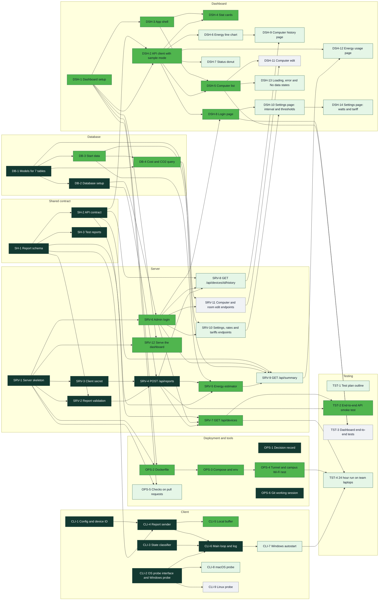
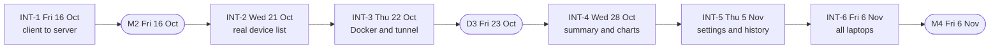
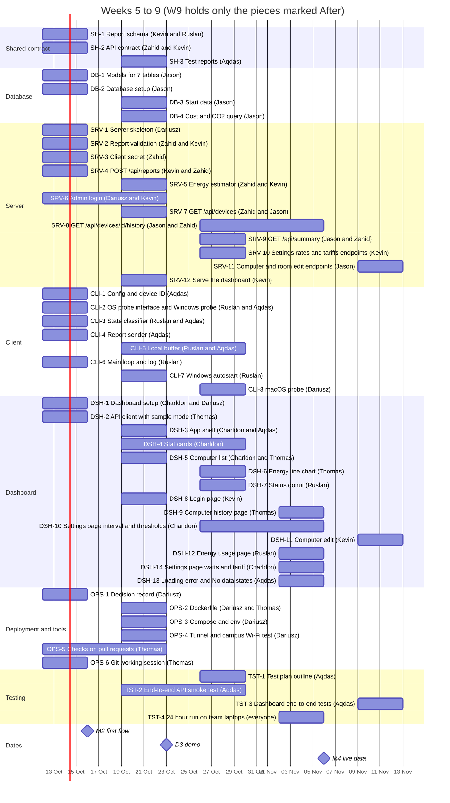

# EcoWattSense implementation plan

Version 0.1 (draft for team review). Date: 9 October 2026.
Authors: Dariusz Jaroch. Drafted with Claude (an AI tool). The content is a proposal until the team agrees on it.
Related YouTrack tasks: EWS-3, EWS-4, EWS-17, EWS-18, EWS-19 (all open). Source: Week 4 Activities, slides 2 to 4.

## 1. What this document is

The tutorial asks for three things. First, break the features into pieces that one person or a pair can build. Second, find which pieces depend on each other. Third, put the pieces in order, give each piece an owner and check that the work is fair.

This document does all three for EcoWattSense, for weeks 5 to 8 (12 October to 6 November). It ends at milestone M4. Later weeks are planned after D3.

Short result:

- 52 pieces in 7 groups. Every piece is 11 hours or less.
- 10 pieces can start on day one because they need nothing else.
- 6 dates where parts must fit together (section 4.4). The first is M2 on Friday 16 October.
- The plan needs about 252 hours of building until M4. We have about 256 hours if everyone gives 8 hours a week. Weeks 5 and 6 are about 23 percent over the weekly capacity. Weeks 7 and 8 have room. Section 6 shows what we can move.

## 2. What the plan is built on

| Decision or fact | Source |
|---|---|
| Server in Python with FastAPI and SQLite | ADR-001 option A. Section 8 of the ADR is still empty (card OPS-1). |
| Dashboard in React. Backend stays Python. Work on the dashboard starts on Monday 12 October. | Decision of 7 October |
| Server runs in Docker on the Mac of Dariusz, behind a Cloudflare tunnel | Decision of 5 October |
| Admin login is required. A shared secret protects report requests. | Follows from the tunnel (public address) |
| Tables, names and units (state 2, 1, 0; energy in microjoules; `snake_case`) | KB EWS-A-12 and `docs/design/database-data-brief.md` |
| Screens, colours and layout | `docs/design/ui-style-guide.md`, mockup, `dashboard-sample-data.json` |
| Requirements FR-01 to FR-10 and NFR-01 to NFR-07 | D2 document and HLD v0.1 |
| Platform order for the client: Windows, Linux, macOS | ADR-001 section 2 |
| Dates: M2 16 Oct, D3 23 Oct, M4 6 Nov | Planning Report, YouTrack |

Where we do not know something, the document says **Assumption**. Section 7 lists them.

## 3. Activity 1: pieces to build

Each row is one card. A card has one clear result, so you know when it is done. A card with two names is for a pair. The first name leads.

How to read the columns: **Hours** are focused working hours, including tests for that piece. **Done in** is the week when the piece should be finished. **Needed for** says the first date that needs it (M2, D3, M4) or **After** if it can wait until after 6 November. **Req** points to the requirements in the D2 document.

Each person writes the tests for their own cards. Owners are proposals. We decide them together on Wednesday 14 October.

The first four weeks are:

| Week | Dates |
|---|---|
| W5 | 12 to 16 Oct |
| W6 | 19 to 23 Oct |
| W7 | 26 to 30 Oct |
| W8 | 2 to 6 Nov |

### 3.1 Shared contract (SH)

| ID | Piece | What it is | Hours | Who | Needs | Done in | Needed for | Req |
|---|---|---|---|---|---|---|---|---|
| SH-1 | Report schema | File `shared/report_schema.json` with the report fields and 3 example reports. Names as in KB EWS-A-12. | 3 | Kevin + Ruslan (Kevin 2h, Ruslan 1h) | nothing | W5 | M2 | FR-04, FR-09 |
| SH-2 | API contract | File `docs/design/api-contract.md`: every endpoint with a request and a response example. Matches `dashboard-sample-data.json`. | 4 | Zahid + Kevin (Zahid 3h, Kevin 1h) | SH-1 | W5 | M2 | FR-07 |
| SH-3 | Test reports | Valid and invalid example reports for the tests of client and server. | 2 | Aqdas | SH-1 | W6 | M2 | NFR-03 |

### 3.2 Database (DB)

| ID | Piece | What it is | Hours | Who | Needs | Done in | Needed for | Req |
|---|---|---|---|---|---|---|---|---|
| DB-1 | Models for 7 tables | SQLModel classes for locations, devices, reports, energy_rates, tariffs, settings, users. From the ERD (EWS-28) and KB EWS-A-12. | 8 | Jason | nothing | W5 | M2 | FR-09 |
| DB-2 | Database setup | Create tables on start, SQLite path from `.env`, session helper. | 3 | Jason | DB-1 | W5 | M2 | FR-09 |
| DB-3 | Start data | Seed rows: energy_rates (desktop, laptop), first tariff, default settings, admin user from `.env`. | 4 | Jason | DB-1 | W6 | D3 | FR-06 |
| DB-4 | Cost and CO2 query | SQL that sums energy times the price valid at report time. Sorted by day. | 5 | Jason | DB-1, DB-3 | W6 | D3 | FR-06 |

### 3.3 Server (SRV)

| ID | Piece | What it is | Hours | Who | Needs | Done in | Needed for | Req |
|---|---|---|---|---|---|---|---|---|
| SRV-1 | Server skeleton | FastAPI app, settings from `.env`, `GET /api/health`, proxy headers for the tunnel. | 4 | Dariusz | nothing | W5 | M2 | FR-09 |
| SRV-2 | Report validation | Pydantic models from the schema. A bad report gets 422. | 4 | Zahid + Kevin (Zahid 3h, Kevin 1h) | SH-1, SRV-1 | W5 | M2 | NFR-03 |
| SRV-3 | Client secret | Check the shared secret header on report requests. Wrong secret gets 401. | 1 | Zahid | SRV-1 | W5 | M2 | NFR-04 |
| SRV-4 | POST /api/reports | A new device is added on its first report. A report is stored once per device and timestamp. The reply holds the interval and the thresholds. | 8 | Kevin + Zahid (Kevin 5h, Zahid 3h) | SRV-2, SRV-3, DB-2 | W5 | M2 | FR-04, FR-05, FR-09 |
| SRV-5 | Energy estimator | State and device type to watts to microjoules. A measured value is kept. Unknown device type uses a default. Pure function with tests, then connected to SRV-4. | 7 | Zahid + Kevin (Zahid 6h, Kevin 1h) | SH-1, SRV-4, DB-3 | W6 | D3 | FR-06 |
| SRV-6 | Admin login | Password hash, `POST /api/login` and `/api/logout`, session cookie, a check on every read and write endpoint. | 8 | Dariusz + Kevin (Dariusz 4h, Kevin 4h) | SRV-1, DB-2 | W5 to W6 | D3 | FR-01, NFR-04 |
| SRV-7 | GET /api/devices | List of computers with current state, last seen and room. State becomes No data after 3 missed cycles. | 6 | Zahid + Jason (Zahid 4h, Jason 2h) | SRV-4, SRV-6, SH-2 | W6 | D3 | FR-07, FR-10 |
| SRV-8 | GET /api/devices/{id}/history | States and energy of one computer over a time range. | 6 | Jason + Zahid (Jason 3h, Zahid 3h) | SRV-4, SRV-6, SH-2 | W7 to W8 | M4 | FR-03 |
| SRV-9 | GET /api/summary | Counts per state, energy today, cost, CO2 and the series for the chart. | 8 | Jason + Zahid (Jason 5h, Zahid 3h) | SRV-5, DB-4, SRV-6, SH-2 | W7 | M4 | FR-06 |
| SRV-10 | Settings, rates and tariffs endpoints | Read and change report interval, thresholds, watts per device type and tariffs. | 8 | Kevin | SRV-6, DB-3 | W7 | M4 | FR-08 |
| SRV-11 | Computer and room edit endpoints | Change name and room of a computer, archive it, list and add rooms. | 6 | Jason | SRV-6, DB-1 | W9 | After | FR-08 |
| SRV-12 | Serve the dashboard | Static files of the dashboard build at `/`. No-cache headers for the demo. | 2 | Kevin | SRV-1, DSH-1 | W6 | D3 | FR-02 |

### 3.4 Client (CLI)

| ID | Piece | What it is | Hours | Who | Needs | Done in | Needed for | Req |
|---|---|---|---|---|---|---|---|---|
| CLI-1 | Config and device ID | `config.json` in the data folder of the OS. Random UUID on first run. Server URL and secret. | 4 | Aqdas | nothing | W5 | M2 | FR-04 |
| CLI-2 | OS probe interface and Windows probe | `base.py` and `windows.py`: idle seconds, screen locked, CPU percent. Uses the result of spike EWS-23. | 6 | Ruslan + Aqdas (Ruslan 5h, Aqdas 1h) | nothing | W5 | M2 | FR-05 |
| CLI-3 | State classifier | Idle and Unused thresholds give the state 2, 1 or 0. Pure function with tests. | 4 | Ruslan + Aqdas (Ruslan 3h, Aqdas 1h) | nothing | W5 | M2 | FR-05 |
| CLI-4 | Report sender | Build the report from the schema, POST with the secret, read the interval from the reply, handle 201, 401, 422 and 5xx. | 5 | Aqdas | SH-1, CLI-1 | W5 | M2 | FR-04 |
| CLI-5 | Local buffer | Write every report to `buffer.jsonl` first. Send the oldest first. Keep 7 days. Drop a report after 422. | 6 | Ruslan + Aqdas (Ruslan 4h, Aqdas 2h) | CLI-4 | W6 to W7 | D3 | NFR-03 |
| CLI-6 | Main loop and log | Loop with the interval, clean stop, `logs/client.log`. | 3 | Ruslan | CLI-2, CLI-3, CLI-4 | W5 | M2 | NFR-01 |
| CLI-7 | Windows autostart | Task Scheduler entry at log-in. Install steps in `client/README.md`. | 4 | Ruslan | CLI-6 | W6 | M4 | NFR-01 |
| CLI-8 | macOS probe | `macos.py` from the spike `client/spike/macos_probe.py`. Needed only for team laptops that are Macs. | 6 | Dariusz | CLI-2 | W7 | M4 | NFR-06 |
| CLI-9 | Linux probe | X11 first. Only if a team laptop runs Linux. No owner yet. | 8 (estimate) | not assigned | CLI-2 | W8 | After | NFR-06 |

### 3.5 Dashboard (DSH)

| ID | Piece | What it is | Hours | Who | Needs | Done in | Needed for | Req |
|---|---|---|---|---|---|---|---|---|
| DSH-1 | Dashboard setup | Finish the React skeleton from branch EWS-19: Vite, router, `tokens.css`, Roboto and Lucide as local files, folders, ESLint. | 6 | Charldon + Dariusz (Charldon 3h, Dariusz 3h) | nothing | W5 | D3 | FR-02 |
| DSH-2 | API client with sample mode | Fetch wrapper with cookie session. A switch reads `dashboard-sample-data.json` instead of the server. | 4 | Thomas | DSH-1, SH-2 | W5 | D3 | FR-07 |
| DSH-3 | App shell | Sidebar (Dashboard, Computers, Energy Usage, Settings), header, routes. Layout changes at 1024 and 768 px. | 6 | Charldon + Aqdas (Charldon 4h, Aqdas 2h) | DSH-1 | W6 | D3 | FR-02 |
| DSH-4 | Stat cards | Active, Idle and Unused cards with a bar. Energy and cost card. `StateBadge` exists. | 5 | Charldon | DSH-2, DSH-3 | W6 to W7 | D3 | FR-06, FR-10 |
| DSH-5 | Computer list | Table: name, state (dot and word), last activity, power, View button. | 8 | Charldon + Thomas (Charldon 6h, Thomas 2h) | DSH-2, DSH-3 | W6 | D3 | FR-07, FR-10 |
| DSH-6 | Energy line chart | Energy today as a line with the area below. | 8 | Thomas | DSH-2 | W7 | M4 | FR-03 |
| DSH-7 | Status donut | Donut with the total in the middle and a legend. | 4 | Ruslan | DSH-2 | W7 | M4 | FR-10 |
| DSH-8 | Login page | Form, session, route guard, log out. | 6 | Kevin | DSH-2, SRV-6 | W6 | D3 | FR-01 |
| DSH-9 | Computer history page | States and energy of one computer over time. | 8 | Thomas | DSH-6, SRV-8 | W8 | M4 | FR-03 |
| DSH-10 | Settings page: interval and thresholds | Form for the report interval and the Idle and Unused thresholds. Saves through the API. | 6 | Charldon | SRV-10, DSH-8 | W7 to W8 | M4 | FR-08 |
| DSH-11 | Computer edit | Name, room and archive from the Computers page. | 6 | Kevin | SRV-11, DSH-5 | W9 | After | FR-08 |
| DSH-12 | Energy usage page | Energy, cost and CO2 per day, week and month. | 8 | Ruslan | SRV-9, DSH-2 | W8 | M4 | FR-06 |
| DSH-14 | Settings page: watts and tariff | Form for watts per computer type and for price and CO2 per kWh. | 6 | Charldon | DSH-10 | W8 | M4 | FR-06, FR-08 |
| DSH-13 | Loading, error and No data states | Clear messages in every page when data is loading, missing or the server is down. | 4 | Aqdas | DSH-5 | W8 | M4 | FR-10 |

### 3.6 Deployment and tools (OPS)

| ID | Piece | What it is | Hours | Who | Needs | Done in | Needed for | Req |
|---|---|---|---|---|---|---|---|---|
| OPS-1 | Decision record | Write ADR-001 section 8: React dashboard, FastAPI, Docker and tunnel. Fix the report example in section 6. Closes EWS-26 and EWS-16. | 2 | Dariusz | nothing | W5 | M2 | none |
| OPS-2 | Dockerfile | Two stages: Node builds the dashboard, a Python image runs the server. | 6 | Dariusz + Thomas (Dariusz 3h, Thomas 3h) | SRV-1, DSH-1 | W6 | D3 | none |
| OPS-3 | Compose and env | `docker-compose.yml` with the server and cloudflared. `.env.example`. `.env` in `.gitignore`. | 4 | Dariusz | OPS-2 | W6 | D3 | none |
| OPS-4 | Tunnel and campus Wi-Fi test | Stable address. Run `scripts/wifi_check.py` on the campus Wi-Fi. Plan B: phone hotspot. | 4 | Dariusz | OPS-3 | W6 | D3 | none |
| OPS-5 | Checks on pull requests | GitHub Actions on pull requests to dev: pytest, ruff, dashboard build. | 6 | Thomas | SRV-1, DSH-1 | W5 to W6 | M4 | none |
| OPS-6 | Git working session | One hour for everyone: branch, pull request, review, conflicts. | 3 | Thomas | nothing | W5 | M2 | none |

### 3.7 Testing (TST)

| ID | Piece | What it is | Hours | Who | Needs | Done in | Needed for | Req |
|---|---|---|---|---|---|---|---|---|
| TST-1 | Test plan outline | What we test, how and who (task EWS-8). Feeds D5. | 4 | Aqdas | nothing | W7 | M4 | none |
| TST-2 | End-to-end API smoke test | Pytest: start the server, post a sample report, read it back from `GET /api/devices`. | 4 | Aqdas | SRV-4, SRV-7 | W6 to W7 | D3 | none |
| TST-3 | Dashboard end-to-end tests | Playwright in `tests/e2e`: log in, see the list, see a chart. | 8 | Aqdas | DSH-5, DSH-8 | W9 | After | none |
| TST-4 | 24 hour run on team laptops | Install the client on every team laptop. Check the dashboard after 24 hours. | 11 | everyone (Aqdas 2h, Dariusz 2h, Ruslan 2h, Charldon 1h, Jason 1h, Kevin 1h, Thomas 1h, Zahid 1h) | CLI-7, OPS-4, SRV-7 | W8 | M4 | none |

Not in this plan: the D3 slides, the D4 report, the logbooks and the Reports page of the mockup (saved reports for people). The Reports page is a future idea (KB EWS-A-10).

## 4. Activity 2: dependencies and order

### 4.1 Dependency map

An arrow from A to B means: B needs A. Colour shows the first date that needs the piece.

Legend: dark green = needed for M2, bright green = needed for D3, pale green = needed for M4, grey = after M4.

### 4.2 Pieces that can start at once

These need nothing else: SH-1 (Kevin), DB-1 (Jason), SRV-1 (Dariusz), CLI-1 (Aqdas), CLI-2 (Ruslan), CLI-3 (Ruslan), DSH-1 (Charldon), OPS-1 (Dariusz), OPS-6 (Thomas), TST-1 (Aqdas).

Two of them are small but block many others, so they come first on Monday 12 October:

- **SH-1 Report schema.** Client and server both read it. Kevin, with Ruslan.
- **DB-1 Models.** The server cannot store anything without them. Jason can start from KB EWS-A-12 before the ERD picture is final.

### 4.3 Longest chains

A chain is a line of pieces where each one waits for the one before. A delay in a long chain moves the date.

| Chain | Why it matters |
|---|---|
| DB-1, DB-2, SRV-4 (then SRV-5, SRV-9, DSH-12) | The first report must be stored (M2). Cost and CO2 come after that. |
| DB-1, DB-2, SRV-6, SRV-10, DSH-10, DSH-14 | Login first, then settings, then the settings pages. They end the plan, in week 8. |
| SH-1, SRV-2, SRV-4, SRV-7, DSH-5 | A real computer list in the dashboard (INT-2). |
| SRV-6, DSH-8 | The tunnel makes the dashboard public, so login must work before D3. |

The dashboard does not have to wait for the server. Card DSH-2 reads `dashboard-sample-data.json` in sample mode. So the screens for D3 can be built while the API is still being written. This is the main way to avoid blocking.

### 4.4 Where the parts must fit together

| ID | Date | Name | What we check | Pieces that must be done |
|---|---|---|---|---|
| INT-1 | Fri 16 Oct (M2) | Client to server to database | A Windows client sends a real report. The server stores it. `curl` shows it. | SH-1, CLI-1, CLI-2, CLI-3, CLI-4, CLI-6, SRV-1, SRV-2, SRV-3, SRV-4, DB-1, DB-2 |
| INT-2 | Wed 21 Oct | Dashboard reads the real API | Sample mode is off. Login works. The computer list shows real devices. | SRV-6, SRV-7, DSH-2, DSH-3, DSH-5, DSH-8 |
| INT-3 | Thu 22 Oct | Docker and tunnel on campus Wi-Fi | Everything runs on the Mac in Docker. Two laptops report through the tunnel. Rehearsal for D3 on Fri 23 Oct. | OPS-2, OPS-3, OPS-4, SRV-12 |
| INT-4 | Wed 28 Oct | Summary and charts on real data | Stat cards, line chart and donut show real numbers. Cost and CO2 match a hand calculation. | SRV-5, DB-4, SRV-9, DSH-4, DSH-6, DSH-7 |
| INT-5 | Thu 5 Nov | Settings and history | Settings page changes the report interval. The next client reply carries the new value. History page shows one computer. | SRV-8, SRV-10, DSH-9, DSH-10, DSH-14 |
| INT-6 | Fri 6 Nov (M4) | All team laptops, live data | Every team laptop has reported for 24 hours. The dashboard shows live data for all of them. | CLI-5, CLI-7, CLI-8, DSH-12, DSH-13, TST-4 |

Each date has one owner who calls the check. Proposal: INT-1 Kevin and Ruslan, INT-2 Charldon and Zahid, INT-3 Dariusz, INT-4 Jason and Thomas, INT-5 Kevin and Charldon, INT-6 Dariusz.

## 5. Activity 3: roadmap

### 5.1 Time line

### 5.2 Week by week

**W5 (12 to 16 Oct).** Contract and first flow. Goal: M2 on Friday 16 October. A Windows client sends a real report and the server stores it.

| ID | Piece | Who | Hours this week |
|---|---|---|---|
| SH-1 | Report schema | Kevin + Ruslan | 3.0 |
| SH-2 | API contract | Zahid + Kevin | 4.0 |
| DB-1 | Models for 7 tables | Jason | 8.0 |
| DB-2 | Database setup | Jason | 3.0 |
| SRV-1 | Server skeleton | Dariusz | 4.0 |
| SRV-2 | Report validation | Zahid + Kevin | 4.0 |
| SRV-3 | Client secret | Zahid | 1.0 |
| SRV-4 | POST /api/reports | Kevin + Zahid | 8.0 |
| SRV-6 | Admin login | Dariusz + Kevin | 4.0 |
| CLI-1 | Config and device ID | Aqdas | 4.0 |
| CLI-2 | OS probe interface and Windows probe | Ruslan + Aqdas | 6.0 |
| CLI-3 | State classifier | Ruslan + Aqdas | 4.0 |
| CLI-4 | Report sender | Aqdas | 5.0 |
| CLI-6 | Main loop and log | Ruslan | 3.0 |
| DSH-1 | Dashboard setup | Charldon + Dariusz | 6.0 |
| DSH-2 | API client with sample mode | Thomas | 4.0 |
| OPS-1 | Decision record | Dariusz | 2.0 |
| OPS-5 | Checks on pull requests | Thomas | 3.0 |
| OPS-6 | Git working session | Thomas | 3.0 |

Total: 79.0 hours.

**W6 (19 to 23 Oct).** Dashboard on sample data, login, Docker and tunnel. Goal: D3 on Friday 23 October. Dashboard on sample data plus one real report (assumption, section 7).

| ID | Piece | Who | Hours this week |
|---|---|---|---|
| SH-3 | Test reports | Aqdas | 2.0 |
| DB-3 | Start data | Jason | 4.0 |
| DB-4 | Cost and CO2 query | Jason | 5.0 |
| SRV-5 | Energy estimator | Zahid + Kevin | 7.0 |
| SRV-6 | Admin login | Dariusz + Kevin | 4.0 |
| SRV-7 | GET /api/devices | Zahid + Jason | 6.0 |
| SRV-12 | Serve the dashboard | Kevin | 2.0 |
| CLI-5 | Local buffer | Ruslan + Aqdas | 3.0 |
| CLI-7 | Windows autostart | Ruslan | 4.0 |
| DSH-3 | App shell | Charldon + Aqdas | 6.0 |
| DSH-4 | Stat cards | Charldon | 2.5 |
| DSH-5 | Computer list | Charldon + Thomas | 8.0 |
| DSH-8 | Login page | Kevin | 6.0 |
| OPS-2 | Dockerfile | Dariusz + Thomas | 6.0 |
| OPS-3 | Compose and env | Dariusz | 4.0 |
| OPS-4 | Tunnel and campus Wi-Fi test | Dariusz | 4.0 |
| OPS-5 | Checks on pull requests | Thomas | 3.0 |
| TST-2 | End-to-end API smoke test | Aqdas | 2.0 |

Total: 78.5 hours.

**W7 (26 to 30 Oct).** Real numbers: energy, cost and CO2. Settings endpoints. Client runs by itself on Windows and on the Mac.

| ID | Piece | Who | Hours this week |
|---|---|---|---|
| SRV-8 | GET /api/devices/{id}/history | Jason + Zahid | 3.0 |
| SRV-9 | GET /api/summary | Jason + Zahid | 8.0 |
| SRV-10 | Settings, rates and tariffs endpoints | Kevin | 8.0 |
| CLI-5 | Local buffer | Ruslan + Aqdas | 3.0 |
| CLI-8 | macOS probe | Dariusz | 6.0 |
| DSH-4 | Stat cards | Charldon | 2.5 |
| DSH-6 | Energy line chart | Thomas | 8.0 |
| DSH-7 | Status donut | Ruslan | 4.0 |
| DSH-10 | Settings page: interval and thresholds | Charldon | 3.0 |
| TST-1 | Test plan outline | Aqdas | 4.0 |
| TST-2 | End-to-end API smoke test | Aqdas | 2.0 |

Total: 51.5 hours.

**W8 (2 to 6 Nov).** Settings and history pages, all laptops report for 24 hours. Goal: M4 on Friday 6 November. Rest of the time for fixes and for the D4 report.

| ID | Piece | Who | Hours this week |
|---|---|---|---|
| SRV-8 | GET /api/devices/{id}/history | Jason + Zahid | 3.0 |
| DSH-9 | Computer history page | Thomas | 8.0 |
| DSH-10 | Settings page: interval and thresholds | Charldon | 3.0 |
| DSH-12 | Energy usage page | Ruslan | 8.0 |
| DSH-14 | Settings page: watts and tariff | Charldon | 6.0 |
| DSH-13 | Loading, error and No data states | Aqdas | 4.0 |
| TST-4 | 24 hour run on team laptops | everyone | 11.0 |

Total: 43.0 hours.

**W9 (9 to 13 Nov).** Only pieces marked After. Planned after D3.

| ID | Piece | Who | Hours this week |
|---|---|---|---|
| SRV-11 | Computer and room edit endpoints | Jason | 6.0 |
| DSH-11 | Computer edit | Kevin | 6.0 |
| TST-3 | Dashboard end-to-end tests | Aqdas | 8.0 |

Total: 20.0 hours.

### 5.3 Who does what

Hours per person and week. Capacity is 8 hours per person per week (assumption). Values above 8 are in bold.

| Person | Main area | W5 | W6 | W7 | W8 | Until M4 | After M4 (W9) |
|---|---|---|---|---|---|---|---|
| Dariusz | server skeleton, login, Docker, dashboard setup, macOS probe | **11.0** | **13.0** | 6.0 | 2.0 | 32.0 | 0.0 |
| Kevin | server reports and settings, login page | **11.0** | **11.0** | 8.0 | 1.0 | 31.0 | 6.0 |
| Zahid | server energy and read endpoints | **10.0** | **10.0** | 4.5 | 2.5 | 27.0 | 0.0 |
| Jason | database, summary endpoint | **11.0** | **11.0** | 6.5 | 2.5 | 31.0 | 6.0 |
| Ruslan | Windows client, energy usage page | **12.0** | 6.0 | 6.0 | **10.0** | 34.0 | 0.0 |
| Aqdas | client sender, tests | **11.0** | 7.0 | 7.0 | 6.0 | 31.0 | 8.0 |
| Charldon | dashboard screens, settings page | 3.0 | **12.5** | 5.5 | **10.0** | 31.0 | 0.0 |
| Thomas | dashboard charts, history page, CI, Git help | **10.0** | 8.0 | 8.0 | **9.0** | 35.0 | 0.0 |
| **Team** | | 79.0 | 78.5 | 51.5 | 43.0 | 252.0 | 20.0 |

Team capacity is 64 hours a week. Weeks 5 and 6 need 79.0 and 78.5 hours. Week 7 needs 51.5 and week 8 needs 43.0. In total the plan needs 252 hours until M4 and we have 256.

What this means for fairness:

- Over the four weeks the range is 27 hours (Zahid) to 35 hours (Thomas). This is close to even.
- The load is uneven inside the weeks. In week 5 everyone is above 8 hours except Charldon. In week 6 Dariusz, Kevin, Zahid, Jason, Charldon are above 8 hours. Ruslan, Aqdas, Thomas are at or below it.
- Dariusz also does project management, reviews and the D2 follow-up. These hours are **not** in the table. So Dariusz is the most loaded person in weeks 5 and 6.
- Zahid has the lowest total (27 hours). Nobody in the team has used FastAPI so far (skills survey), so SRV-2 to SRV-4 are done in pairs with Kevin. If the early weeks go well, Zahid can take SRV-10 or SRV-11 from Kevin and Jason.

### 5.4 Who waits for whom

| Blocker | Who waits | What reduces the risk |
|---|---|---|
| SH-1 report schema (Kevin) | Server and client, from Monday 12 October | Finish it on Monday and Tuesday. Review in the same pull request. |
| DB-1 models (Jason) | SRV-4 (Kevin, Zahid) | Start from KB EWS-A-12. Do not wait for the ERD picture. |
| DSH-1 dashboard setup (Dariusz, Charldon) | All dashboard cards | Done on Monday to Wednesday of week 5. Charldon works on it too. |
| SRV-6 login (Kevin, Dariusz) | SRV-7, SRV-9, DSH-8 | The API client has a sample mode, so the screens do not wait. |
| SRV-7 device list (Zahid) | INT-2 | A simple first version with fixed fields is enough. |
| Only Dariusz and Kevin know React | Review of every dashboard pull request | One hour of React start for Charldon, Thomas, Ruslan and Aqdas in week 5. Pairs: Dariusz with Charldon, Kevin with Thomas. |
| Dariusz does Docker, tunnel and the Mac | D3 | The test on campus Wi-Fi is fixed on INT-3. Plan B: phone hotspot. |

## 6. Risks and what we can move

**If weeks 5 and 6 are too full**, move in this order:

1. SRV-5 energy estimator can use fixed watts at first (Zahid). It does not block M2.
2. CLI-5 local buffer moves from W6 to W7 and from D3 to M4. For D3 the client can send without a buffer.
3. DSH-4 stat cards: show only the three state counts at D3. The energy card comes in week 7.
4. OPS-5 checks on pull requests: one workflow with only pytest at first.
5. M2 itself: first report from a small script that sends the example report. The full client loop follows a week later.

**If weeks 7 and 8 are too full**, the first pieces to drop to after M4 are DSH-12 energy usage page and CLI-8 macOS probe. Pieces already marked After are SRV-11, DSH-11, TST-3 and CLI-9.

| Risk | Effect | Action |
|---|---|---|
| Nobody knows FastAPI | Slow start on SRV pieces | Pair work in SRV-2, SRV-3, SRV-4. Kevin reviews. |
| Campus Wi-Fi blocks the tunnel (port 7844) | No live demo at D3 | `scripts/wifi_check.py` on campus. Phone hotspot for the Mac. |
| Energy values are not agreed | DB-3 and SRV-5 stall | Use a first set of numbers and mark them as an estimate in the dashboard. |
| Detecting Idle on a laptop is wrong in some cases | Wrong state on the dashboard | Thresholds are settings. Test in TST-4. |
| A person is ill or away | A card stops | Each area has at least two people. Every pull request gets one review. |

## 7. Assumptions and open points for Wednesday 14 October

1. **Hours.** We assume 8 building hours per person per week. Please check this. Every other number depends on it.
2. **D3 demo.** We assume: dashboard on sample data plus one real report, live data at M4. If D3 must show live data, INT-4 moves to Monday 19 October.
3. **Team dev-backend on GitHub.** Not decided yet. Proposal: Kevin, Zahid, Jason and Dariusz.
4. **Laptops.** Which operating system does each team laptop use? This decides CLI-8 (macOS) and CLI-9 (Linux). The plan has Windows and one Mac.
5. **Numbers for energy.** Watts per computer type, the first price per kWh and the CO2 factor. They are open points from the HLD. DB-3 needs them in week 6.
6. **Tunnel address.** Is a domain in Cloudflare available for a fixed address? Without it the address changes at every start.
7. **Owners.** All names in this document are proposals. Anyone who wants another card says so in a comment on the task in YouTrack.
8. **After the agreement.** The cards become tasks in YouTrack under EWS-3 and EWS-4. The same list is in `implementation-cards.csv`.

## Document history

| Version | Date | Author | Change |
|---|---|---|---|
| 0.1 | 9 October 2026 | Dariusz Jaroch (drafted with Claude) | First draft for team review |

